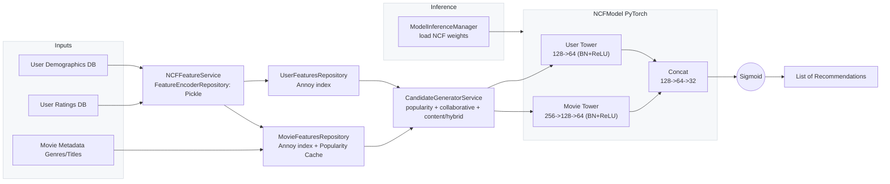
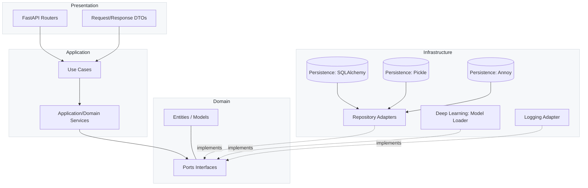

# Neural Recommendation

## 1) What this project is
This is a portfolio project demonstrating a production-style recommendation system built with Clean Architecture. It uses the MovieLens 1M dataset to deliver:
- Personalized cold-start recommendations for new users
- Onboarding movie suggestions by genre
- FastAPI APIs for inference and health checks
- JWT-based auth for user endpoints

Skills showcased:
- Clean Architecture and dependency inversion across layers
- Data science and feature engineering for recommendations
- Neural collaborative filtering with PyTorch
- FastAPI service development and DI
- Robust logging, configuration, and repository patterns

Dataset: MovieLens 1M (ML-1M) for users, movies, ratings, and genres.

## 2) Model architecture
The core model is an NCF-style neural network implemented in PyTorch. It processes user and movie feature vectors with batch-normalized MLP towers, concatenates them, and predicts interaction probability via a sigmoid head. Training uses negative sampling and evaluation targets ranking metrics. Candidate generation blends popularity, collaborative, and content signals.

For a deeper walk-through of the end-to-end modeling, feature preparation, training process, and evaluation, see the notebook `study/0_ncf_binary.ipynb`.

Highlights:
- User tower: linear layers with batch norm and ReLU
- Movie tower: deeper linear stack with batch norm and ReLU
- Fusion: concatenation followed by MLP and sigmoid output
- Negative sampling and candidate generation for efficient training and ranking

Recommendation pipeline (NCF-based):



## 3) Project architecture (Clean Architecture)
Layers and responsibilities:
- Domain: entities and ports (interfaces). Examples: `domain/models`, `domain/ports`.
- Application: use cases and domain services orchestrating ports. Examples: `applications/services`, `applications/use_cases`.
- Infrastructure: adapters for databases, files, ML model loading, logging. Examples: `infrastructure/adapters`, `infrastructure/persistence`, `infrastructure/deep_learning`, `infrastructure/logging`.
- Presentation: FastAPI routers and request/response DTOs. Examples: `presentation/routers`, `applications/interfaces/dtos`.




## 4) Getting started and running
Prerequisites:
- clang installed on your system
- Python (managed via Poetry), Docker running for the database

Prepare ML-1M data:
- Place `ml-1m.zip` under `data/` and run:
```bash
cd data
unzip ml-1m.zip
cd -
```

Install Poetry shell plugin:
```bash
poetry self add poetry-plugin-shell
```

Run database:
```bash
docker compose up
```

Run the application:
```bash
poetry run task run
```

Run tests:
```bash
poetry run task test
```