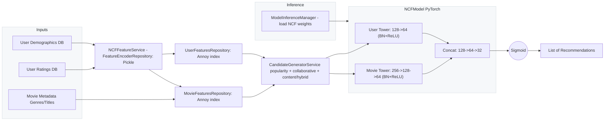
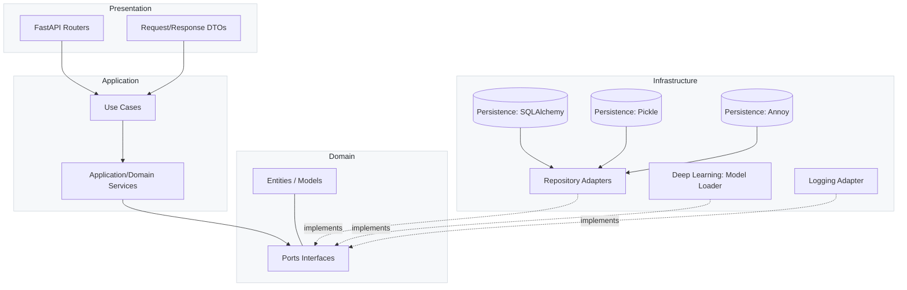

# Neural Recommendation

## 1 What this project is
This is a portfolio project demonstrating a production-style recommendation system built with Clean Architecture. It uses the MovieLens 1M dataset to deliver:
- Personalized cold-start recommendations for new users
- Onboarding movie suggestions by genre
- FastAPI APIs for inference and health checks
- JWT-based auth for user endpoints

Skills showcased:
- Clean Architecture and dependency inversion across layers
- Data science and feature engineering for recommendations
- Neural collaborative filtering with PyTorch
- FastAPI service development and DI
- Robust logging, configuration, and repository patterns

Dataset: MovieLens 1M (ML-1M) for users, movies, ratings, and genres.

## 2 Model architecture
The core model is an NCF-style neural network implemented in PyTorch. It processes user and movie feature vectors with batch-normalized MLP towers, concatenates them, and predicts interaction probability via a sigmoid head. Training uses negative sampling and evaluation targets ranking metrics. Candidate generation blends popularity, collaborative, and content signals.

For a deeper walk-through of the end-to-end modeling, feature preparation, training process, and evaluation, see the notebook `study/0_ncf_binary.ipynb`.

Highlights:
- User tower: linear layers with batch norm and ReLU
- Movie tower: deeper linear stack with batch norm and ReLU
- Fusion: concatenation followed by MLP and sigmoid output
- Negative sampling and candidate generation for efficient training and ranking

Recommendation pipeline (NCF-based):



## 3 Project architecture (Clean Architecture)
Layers and responsibilities:
- Domain: entities and ports (interfaces). Examples: `domain/models`, `domain/ports`.
- Application: use cases and domain services orchestrating ports. Examples: `applications/services`, `applications/use_cases`.
- Infrastructure: adapters for databases, files, ML model loading, logging. Examples: `infrastructure/adapters`, `infrastructure/persistence`, `infrastructure/deep_learning`, `infrastructure/logging`.
- Presentation: FastAPI routers and request/response DTOs. Examples: `presentation/routers`, `applications/interfaces/dtos`.




## 4 Important Decisions
- We decided to use annoy index to movie features repository and user features repository to simpliify the project.
- When generating candidates: we consider that if the user rated a movie in 4 or more stars, it's a positive candidate.


## 5 Getting started and running
Prerequisites:
- clang installed on your system
- Python (managed via Poetry), Docker running for the database

Prepare ML-1M data:
- Place `ml-1m.zip` under `data/` and run:
```bash
cd data
unzip ml-1m.zip
cd -
```

Install Poetry shell plugin:
```bash
poetry self add poetry-plugin-shell
```

Run database:
```bash
docker compose up
```

Run the application:
```bash
poetry run task run
```

Run tests:
```bash
poetry run task test
```

## 5) API endpoints

Base URL defaults to `http://localhost:8000`.

- Auth
  - POST `/auth/token`: OAuth2 password flow. Body: form fields `username` (email), `password`. Response: `{ access_token, token_type }`.

- Users
  - POST `/users/`: Create user. Body: `UserSchema`. Response: `UserPublic`.
  - GET `/users/me`: Current user info. Requires Bearer token.
  - GET `/users/`: List users with pagination/filter. Query: `page`, `size`, etc. Response: `UserList`.
  - PUT `/users/{user_id}`: Update user. Requires Bearer token. Body: `UserSchema`. Response: `UserPublic`.
  - DELETE `/users/{user_id}`: Delete a user. Requires Bearer token. Response: `Message`.
  - DELETE `/users/`: Delete all users. Response: `Message`.

- Movies
  - POST `/movies/`: Create movie. Body: `MovieSchema`. Response: `MoviePublic`.
  - GET `/movies/{movie_id}`: Get movie by id. Response: `MoviePublic`.
  - GET `/movies/`: List movies with pagination/filter. Query: `page`, `size`, etc. Response: `MovieList`.
  - PUT `/movies/{movie_id}`: Update movie. Body: `MovieSchema`. Response: `MoviePublic`.
  - DELETE `/movies/{movie_id}`: Delete movie. Response: `Message`.

- Ratings
  - POST `/ratings/`: Bulk create ratings. Body: `List[RatingSchema]`. Response: `List[RatingPublic]`.

- Recommendations
  - POST `/recommendations/cold-start`: Generate recommendations for a new user. Body: `NewUserRecommendationRequest`. Response: `RecommendationResultResponse`.
  - GET `/recommendations/onboarding-movies`: Get onboarding movies. Query: `num_movies`. Response: `OnboardingMoviesResultResponse`.
  - GET `/recommendations/health`: Health check.